# Реализация циклического буффера (ring buffer) для общения между независимыми процессами

Данная реализация использует API Posix для выделения shared memory и
использования её как кольцевого буффера. Использован трюк с маппингом
двух разных участков виртуальной памяти к одному для эффективной
реализации ring buffer.

## Детали реализации

Код написан на языке C11 и предназначен только для GNU/Linux.

Процесс writer создаёт ring buffer, вызывася *shm_open*, *ftruncate* и
*mmap*. Процессу, читающему из буффера, нужно только замапить память.

Кольцевой буффер в данном репозитории способен записывать и считывать
непрерывные куски памяти произвольного размера. При этом операции
являются быстрыми и не включают операций взятия по модулю. Это
достигается умным использованием механизма виртуальной памяти. Для
одного блока физической памяти выделяются два блока виртуальной
памяти, которые лежат друг за другом. Таким образом, имеем быстрый
кольцевой с почти 0 сложной логики внутри. Всю работу за нас делает
*Memory Management Unit* в железе. Больше информации в
[статье](https://lo.calho.st/posts/black-magic-buffer/).

Поскольку каждый процесс имеет свое адресное пространство, то
указатель на начало буффера каждый процесс имеет свой. Маппинг
виртуальных страниц для кольцевого буффера поэтому нужно проводить в
каждом отдельном процессе.

Для механизма блокировки были протестированы два подхода:

1) *mutex + conditional variable*. Пишущий процесс делает
*pthread_cond_signal*, а читающий процесс ждет, вызывая
*pthread_cond_wait*.

2) *SeqLock*. Из-за специфики задачи(1 writer и 1 reader) была
использована простейшая реализация SeqLock. Writer инкрементирует
атомарную переменную *version* перед записью и после записи. Reader
смотрит значение *version*: если оно делится на два, то значит ring
buffer не занят, в противном случае reader ждет пока *version* не
станет делиться на два.

Writer периодически пишет сообщения длиной 20-40 байт. Каждое
сообщение содержит в себе таймстемп и дополнительную ненужную для
задачи информацию.

Reader читает сообщения так быстро, как сможет и пишет информацию,
которая позже анализируется, в большой буффер. Буффер затем
записывается в файл, когда программа завершается. Это сделано, чтобы reader был максимально быстрым
и не тратил время на дополнительные IO операции.

Далее информация используется простенькими python скриптами, которые
выводят графики, показанные ниже.

## Запуск

Проект использует прекрасную систему сборки *make*.

Сборка бинарников(требуется *gcc* и стандартные Linux библиотеки):
```bash
make # или make CFLAGS="-O2 -DRING_BUFFER_USE_MUTEX=1" для медленной реализации, которая не греет ноутбук
```

Запуск бенчмарков(требуется *python3* и зависимости из файла *py/requirements.txt*):
```bash
make benchmark
```

## Анализ буффера с блокировкой при чтении/записи

С помощью python скрипта были перебраны различные конфигурации и
построены зависимости.

Измерения производились на ноутбке с 4ГБ оперативной памяти,
процессором Intel i3-8130U (4) @ 3.400GHz и операционной системой Arch
Linux.

### Маленький размер кольцевого буффера

Ниже приведена таблица графиков с измерениями. Были проведены тесты
для размеров буфферов 4Кб(размер страницы OS), 16Кб и 32Кб.

| 25 сообщений в секунду    |  50 сообщений в секунду    | 100 сообщений в секунду    | 200 сообщений в секунду     | 500 сообщений в секунду     | 750 сообщений в секунду     | 1000 сообщений в секунду     |
|---------------------------|----------------------------|----------------------------|-----------------------------|-----------------------------|-----------------------------|------------------------------|
|   |  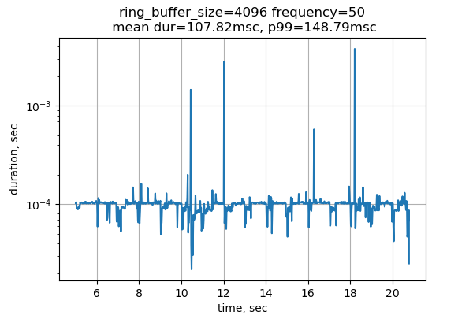  | 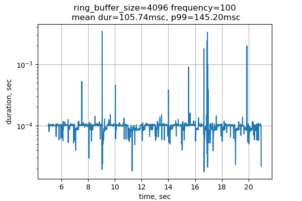  |    |    |    |    |
|  |   |  |  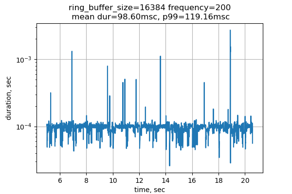 |   |   |   |
|  |   | 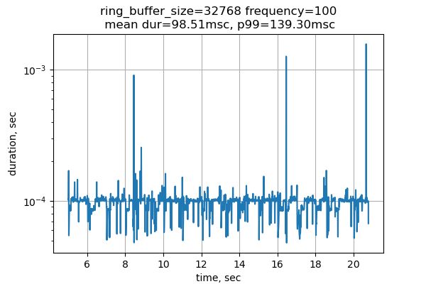 |   |  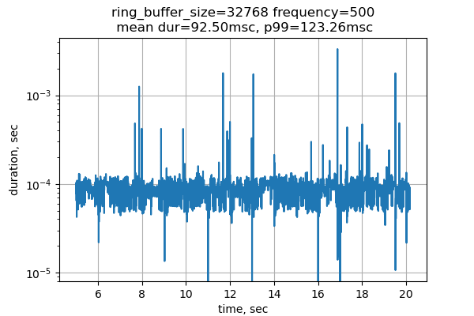 |  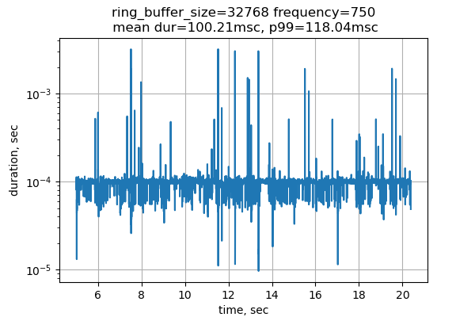 |   |

Время отклика варьируется от 60 мкс до 100 мкс. При увеличении
количества сообщений скорость обработки немного улучшается, но явной
зависимости не видно.


### Средний размер кольцевого буффера

Были проведены тесты для размеров буфферов 256Кб, 1Мб, 8Мб и 32Мб.

|  200 сообщений в секунду       | 500 сообщений в секунду        | 1000 сообщений в секунду        | 1500 сообщений в секунду        | 2000 сообщений в секунду        |
|--------------------------------|--------------------------------|---------------------------------|---------------------------------|---------------------------------|
|  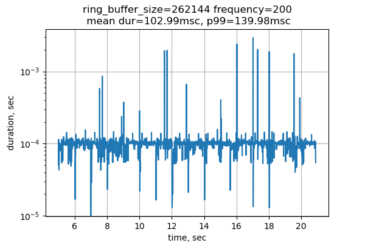   |  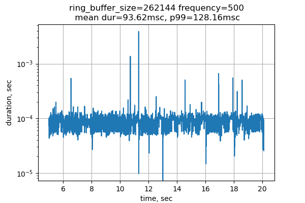   |  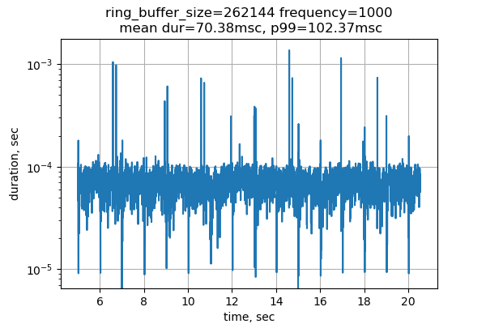   |  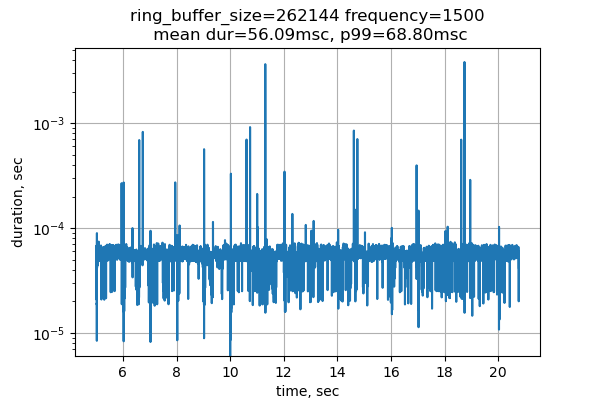   |     |
|  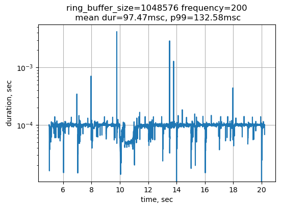  |  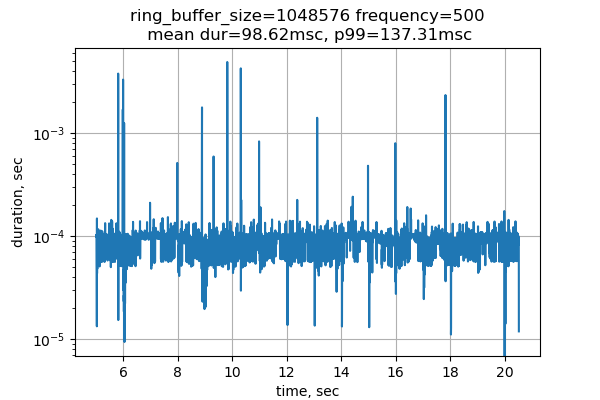  |    |  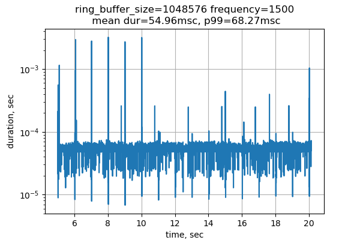  |    |
|    |  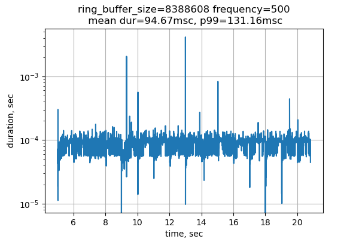  |    |    |    |
|  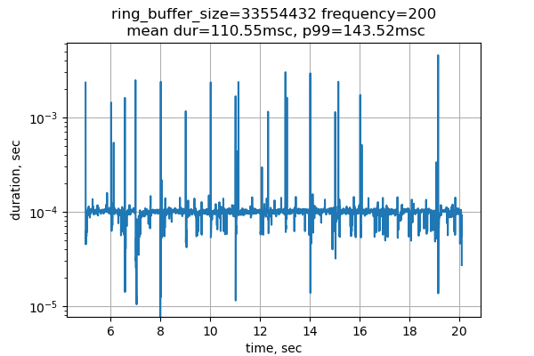 |   |   |  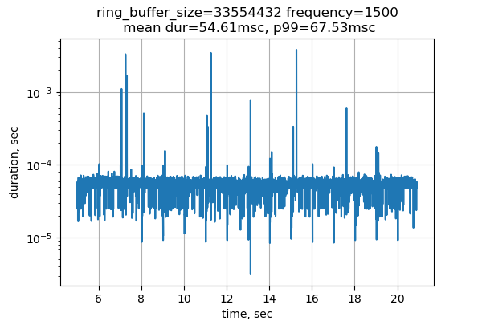 |   |

Время ответа не меняется до 1000 сообщений в секунду. Зато он резко
падает при 1500 сообщений в секунду. При всех размерах буффера время
отклика при 1500 сообщений в секунду занимает около 50 мкс.

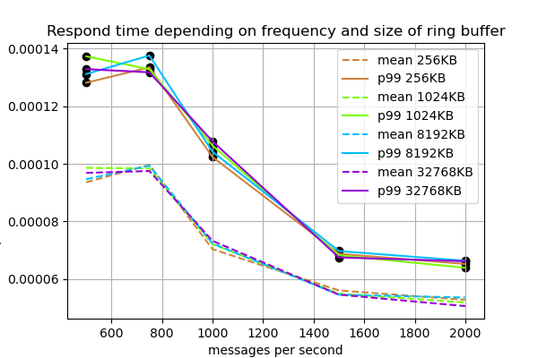

Вывод: при высоком частоте отправки сообщений время отклика падает.

## Анализ буффера без блокировки при чтении/записи (SeqLock)

Также с помощью python скрипта были перебраны различные конфигурации и
построены зависимости.

Измерения производились на ноутбке с 4ГБ оперативной памяти,
процессором Intel i3-8130U (4) @ 3.400GHz и операционной системой Arch
Linux. Ноутбук перегревался во время эксперимента и измерения ниже
могут быть неточными из-за троттлинга процессора.

Цифры для данной реализации отличаются от предыдущего пункта:
1) latency как минимум на порядок ниже;
2) кольцевой буффер с маленьким размером имеет показатель лучше в данном случае;
3) из-за того, что reader постоянно использует ЦПУ пока ждет
сообщение, мой слабый ноутбук греется и показатели получаются довольно
нестабильными.

### Маленький размер кольцевого буффера

Ниже приведена таблица графиков с измерениями. Были проведены тесты
для размеров буфферов 4Кб(размер страницы OS), 16Кб и 32Кб.

| 25 сообщений в секунду    |  50 сообщений в секунду    | 100 сообщений в секунду    | 200 сообщений в секунду     | 500 сообщений в секунду     | 750 сообщений в секунду     | 1000 сообщений в секунду     |
|---------------------------|----------------------------|----------------------------|-----------------------------|-----------------------------|-----------------------------|------------------------------|
|   |    |   |    |    |    |    |
|  |   |  |   |   |   |   |
|  |   |  |   |   |  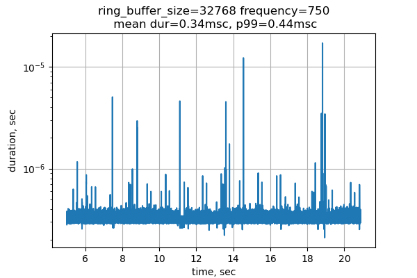 |   |

Время отклика варьируется от 0.4 мкс до 1.5 мкс. При увеличении
количества сообщений latency стабилизируется и достигает меньших
значений около 0.5.


### Средний размер кольцевого буффера

Были проведены тесты для размеров буфферов 256Кб, 1Мб, 8Мб и 32Мб.

|  200 сообщений в секунду       | 500 сообщений в секунду        | 1000 сообщений в секунду        | 1500 сообщений в секунду        | 2000 сообщений в секунду        |
|--------------------------------|--------------------------------|---------------------------------|---------------------------------|---------------------------------|
|     |     |     |     |     |
|    |    |    |    |    |
|    |    |    |    |    |
|   |   |   |   |   |

Также видна тенденция, при которой с увеличением частоты сообщений
latency падает. Но время отклика имеет самое низкое значение(~0.5 мкс)
при наименьшем размере буффера 256Кб. Я объясняю это тем, что буфферы
большего размера не влезают в кэш процессора.


## TODO

 - [ ] протестировать разные размеры сообщений;
 - [ ] сделать CPU ID аргументом бинарников.
