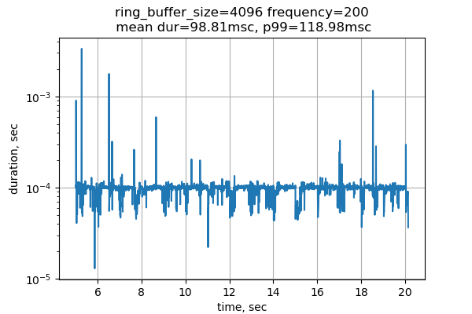
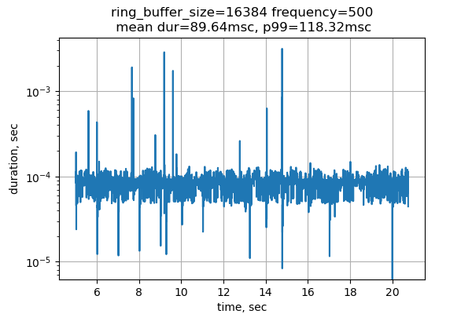

# Реализация циклического буффера (ring buffer) для общения между независимыми процессами

Данная реализация использует API Posix для выделения shared memory и
использования её как кольцевого буффера. Использован трюк с маппингом
двух разных участков виртуальной памяти к одному для эффективной
реализации ring buffer.

## Детали реализации

Код написан на языке C11 и предназначен только для GNU/Linux.

## Запуск

Проект использует прекрасную систему сборку *make*.

Сборка бинарников(требуется *gcc* и стандартные Linux библиотеки):
```bash
make
```

## Анализ

С помощью python скрипта были перебраны различные конфигурации и
построены зависимости.

| 10 сообщений в секунду             |  50 сообщений в секунду | 100 сообщений в секунду | 200 сообщений в секунду | 500 сообщений в секунду | 750 сообщений в секунду | 1000 сообщений в секунду
:-------------------------:|:-------------------------:
|   |    |   |    |    |    |   |
|   |    |   |    |    |    |   |

Время отклика варьируется от 60 мкс до 80 мкс. При увеличении
количества сообщений скорость обработки немного улучшается.

## TODO

 - ring buffer без блокировок (не стал реализовывать, поскольку в задаче всего 2 потока)
 - разобраться с ошибкой, при которой writer крашится при указании размера ring buffer-а >64K
